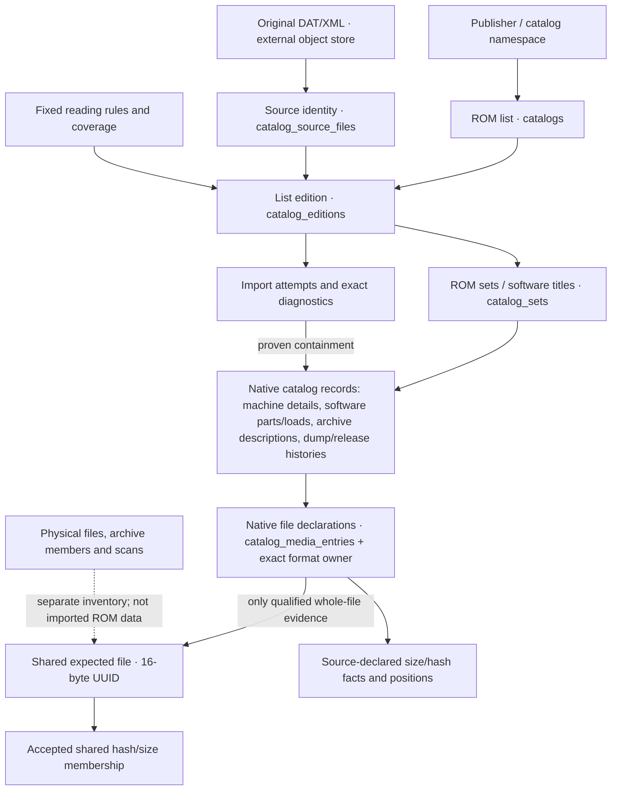
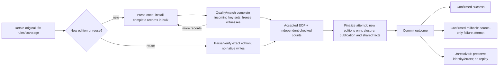

# ROM catalog model — approval proposal

Status: NOT CLEAR; complete-model review and explicit user approval remain
outstanding. This is the entry point for
[MAMEC-62](https://lific.mjc.lol/MAMEC/issues/MAMEC-62), not a production
cutover or permission to modify an existing database. Signed `71a7de8` is the
current executable proposal; `f3a6e66` and `12d9135` are prior snapshots. Independent
bounded review verifies the five original fixes. Complete current-target review
has finished its base artifact and Lific coverage, but found two extensions:
original-only same-view highlight mapping and late file-byte policy insertion.
Their fixes in `71a7de8` await complete-model re-review. The DOC-29 checkpoint
records coverage; it does not change the NOT CLEAR verdict. Complete-model
review and explicit approval must identify the successor artifact.

Both XML repair and whole-file byte-policy facets seal at their first reference from
either `catalog_editions` or `catalog_imports`, including running and failed
source-only imports. Facets may be constructed before first use; a changed
policy uses a new reading-rules identity. This is enforced in the candidate,
not yet implemented in the application's importer.

## What belongs where

A catalog is a ROM list published under a stable namespace. An edition is that
list interpreted from one retained input with fixed reading rules and coverage.
Importing it again creates another attempt, not another edition. A game's file
entry describes what that list says; a shared file identifies the expected
complete file across lists. These must not be collapsed into one row.

The diagram summarizes ownership; the exact keys/fields are the native SQL and
ledgers below. Physical roots have typed owners, not fabricated child-registry
IDs. Virtual root groups are membership owners, not parsed XML elements.

## Storage decisions

| Concern | Proposed contract |
|---|---|
| Original document | Retained externally, verified by digest/length; SQLite stores identity, locator and acquisition provenance, never the document or ROM/media payload |
| Exact byte reproduction | Retrieve the retained original; metadata queries, semantic history and backup do not reparse it. Re-emitting supported catalog facts is not a promise to recover original whitespace/quote spelling from normalized values |
| Every supported specification field | Persistent typed native owner and canonical position/state/order route in the field ledgers; no JSON, generic EAV/XML bag or silent field loss to meet a size target |
| Edition identity | Unique `(catalog_id, source_file_id, reading_rules_id, coverage_id)`; import attempts, receipts and previous-edition provenance are separate |
| Source element / file occurrence | Globally unique integer owner ID, actual typed parent and raw sibling/mixed order; not a file UUID, list ordinal or publisher number |
| Shared expected file | Persistent 16-byte BLOB UUID with identity-registry FK. Equal qualified files across lists share it; declarations and their provenance remain separate occurrences |
| UUID redirects | Append-only published decisions resolve issued UUIDs without rewriting their original source assignments; cross-registry edges/cycles are invalid |
| Native values | Missing, empty, invalid and explicit-default states remain distinguishable under the selected format. Exact hash spelling uses the canonical declaration/override contract, not a second hash model |
| Hash bytes | Interned binary `hash_values`; declarations retain their source field, occurrence, scope and native location. CHD-header, segment, origin and NFO hashes are not whole-file identity |
| Shared size/hash tables | Maintained accepted membership used by hot-path matching. Native declarations remain the sole source witnesses; query-only qualification/evidence views are not stored duplicate per-list projections |
| Warnings/errors | Per-attempt message, bounded exact BLOB excerpt, zero-based end-exclusive highlight inside that excerpt, independent source-view ranges and typed actual-owner links where containment is proved |
| Source-only diagnostics | Retain messages and available coordinates when no full owner interval is known. Never borrow an ancestor's interval to manufacture a child link |
| Acquisition | Raw repeated headers and interpreted nullable declared filename belong to the fetch attempt; receipts point to it and the retained source, without copying acquisition facts into catalog fields |

A highlight maps the entire known problem span into the excerpt or has both
bounds NULL; it is never a clipped approximation. An original-only range can
provide that mapping for a retained-original excerpt, but not for a decoded
excerpt in another byte view. A zero-width anchor may sit at excerpt EOF.
Audit and INSERT/UPDATE guards use the same generated coordinate predicates.

All public owner IDs/cursors use distinct Rust newtypes and the explicit
registry-generation rules. Nullable UUID means evidence cannot establish a
shared file; it does not mean the native catalog fact is discarded. A publisher's
archive number, unresolved clone literal or equal name is never a native key.

## Supported input contracts and exact inventories

| Input | Native ownership / inventory | Boundary |
|---|---|---|
| [MAME machine XML](https://lific.mjc.lol/MAMEC/pages/93) | `mame.sql`, `mame-owners.tsv`, `mame-field-coverage.tsv`, `mame-field-presence.tsv`, `mame-hash-positions.tsv`, `mame-counts.tsv` | Pinned MAME 0.289 specification and named observed compatibility policy; proposed strict dialect is `strict-dtd`, not inferred from filenames |
| [MAME software-list XML](https://lific.mjc.lol/MAMEC/pages/95) | Corresponding `software.*` / `software-*.tsv`; title → part → data/disk area → actual load/file declarations | Pinned 0.289 loading contract, checked continue/reload/ignore/fill behavior; partial byte groups warn and process as agreed, rather than being silently truncated or rejected |
| [Logiqx XML](https://lific.mjc.lol/MAMEC/pages/94) | `logiqx_cmp.sql` and the `logiqx_cmp-*` ledgers | Pinned DTD 1.5 versus explicit compatible rules; source-declared root metadata is distinct from computed original digests and acquisition facts |
| [ClrMamePro text](https://lific.mjc.lol/MAMEC/pages/94) | Same SQL/ledgers with concrete CMP form/scalar/flag/comment owners | Bounded `clrmamepro-declared-text-compat-v1` adapter; quoted-empty values, keyword/value anchors and order survive. No external producer specification or arbitrary nested TOSEC/PureDOS grammar is claimed |
| [No-Intro DAT XML](https://lific.mjc.lol/MAMEC/pages/97) | `no_intro.sql`, `no_intro-*` ledgers, native DAT/XSI owners | Acquired v3/v4 schema contracts and separately named compatible deviations; namespace/QName capture while context exists, strict-only ID/IDREF rules |
| [No-Intro database export](https://lific.mjc.lol/MAMEC/pages/97) | Same No-Intro ledgers; game → archive descriptions / dumping sources / releases → distinct details, serials and files | Observed versioned wire contract, including selected narrow NUL recovery; two envelope/header-placement modes stay distinct. Current-file hash scope remains unknown unless independently trusted |
| [Synthetic No-Intro P/C fixture](https://lific.mjc.lol/MAMEC/pages/92) | Explicit `no_intro_pc_*` owners in the same fragment | Existing fixture adapter only, not authentic DAT-o-MATIC P/C support |

The inventories contain 571 contextual field rows, 93 native kinds, 32 hash
routes and 22 source relationship-position routes. Counts have different units:
field rows, position codes, parser events and physical rows are not interchangeable
proof of completeness. Four `*-counts.tsv` files define six typed family event
vectors; export additionally retains its existing 18 edition and nine parent-
local counter shapes. Independent expected totals never come from SQL row counts.

Authentic DAT-o-MATIC P/C, OfflineList and unpinned PureDOS extensions remain
unsupported. The observed export ledger has 135 identified fields; an unlocated
137-field CSV does not identify two additional fields. No owners are invented
for unnamed fields. Unsupported producer/byte-coverage contracts remain explicit,
not hidden by a format-family label or a green synthetic test.
Their format tickets remain open: design approval does not waive authentic
grammar research, required format implementation or the remaining PLAN-3 work.

For exact original-to-target state/key/order decisions, read the four format
notes and [DOC-20](https://lific.mjc.lol/MAMEC/pages/137). The tables above are an
index, not a replacement field dictionary. Collector-facing diagrams are in
[DOC-7](https://lific.mjc.lol/MAMEC/pages/89); exact shared keys are in
[DOC-21](https://lific.mjc.lol/MAMEC/pages/138).

## Relationships and query behavior

Source declarations keep their literal, reported kind and canonical native
position; resolution is a separate assertion. The eight generic endpoint kinds
are actual set, actual media entry, actual native archive, issued shared file,
declared hash, observed whole-file hash, unresolved catalog literal and external
record. Source-only DAT publisher-ID/archive-number/merge references do not
become generic set-name endpoints. Candidate `media_entry` deliberately renames
the current unresolved `asset_requirement` subtype.

Evidence/accepted-review sealing checks exact payload, subtype, actual owners
and required publication. It freezes endpoint/assertion/rule meaning, including
unresolved edition context. New endpoints can be created after importing their
native edition. Published review history retains decisions, notes, time and
replacement edges; select the latest published review before filtering its
decision. Unsealed drafts do not hide earlier visible reviews.

The [query contract](query-contract.md) and its two native companion consumer
crosswalks define build/plan/audit, dependencies, reconciliation, explanations,
diagnostics, semantic history, latest selection, cursor validation, original
recovery, scanner separation and paired backup. Explicit proposed API changes
include typed edition/message identities, reading-rule provenance instead of a
free-form parser label, and publication-time history ordering. They require
approval; they are not unannounced compatibility claims.

## One-pass, bulk import and failure behavior

The [publication contract](publication-contract.md) specifies private Rust
typestates, complete-batch capability ownership, final flushing before EOF,
reuse without native writes, independent checked event/ordinal accumulation,
and confirmed commit/rollback/unresolved outcomes. Semantic parsing is one pass;
retention/decompression/hash verification is separate source I/O, not permission
to reparse discarded fields or build a whole-document DOM.

Use stable-shape bulk inserts and bulk digest/identity resolution, including
within-batch duplicates and bridges. The only supported identity-dedup path is
checked, set-based insertion with `INSERT ... SELECT ... WHERE NOT EXISTS`
against the full typed key; candidate collision guards reject conflicting
identities. Blind `INSERT OR IGNORE` and UPSERT are unsupported. No per-row
full audit, N+1 lookup loop or smaller batch hides query cost. Only published
owners and this session's installed, complete, frozen batches may participate
in matching. Unrelated or half-installed drafts cannot leak in. Final global
checks do not retroactively turn an incomplete batch into evidence.

The MAME, Logiqx/CMP and No-Intro capture contracts, together with the software
notes and publication contract, specify raw order,
namespace/QName capture, keyword anchors, exact byte/coordinate views, physical
root/element ends and repair mappings. Unrepaired transport-decoded bytes and
retained original bytes remain distinct; repaired buffers have no invented
persisted source-view identity. Exact excerpts/highlights do not imply a whole
document or subtree is retained in SQLite.

## Approval versus implementation evidence

| Gate | Required result |
|---|---|
| Complete design | All shared/native dictionaries, diagrams, contracts and composed DDL agree; F1–F5 fixes are reviewed on an identified successor artifact; complete-model Sol 6.1 medium review/fix/re-review is CLEAR on that artifact; user explicitly approves that revision |
| Greenfield cutover after approval | Remove old schema/database/import/query paths and all migrations/legacy conversions; existing database fingerprints are rejected, not converted. No destructive local DB/corpus/profile operation is implied by design approval |
| Correct implementation | Typed one-pass capture, all supported fields, native source ownership/order, qualified persistent UUID identity, exact diagnostics, source-free readers/history and paired backup; fault injection proves whole-transaction rollback and commit resolution |
| Performance | Actual optimized large imports, CPU flamegraphs and heaptrack; no import exceeding ten minutes, including instrumented runs, and no smaller corpus/batch used to hide algorithmic cost. Ordinary compatibility-fact reads target sub-millisecond work through real improvements |
| Final verification | Real per-format corpus/field/query evidence and complete locked `devenv test`, Sol review cycles, GPG-signed commits pushed to main |

Current SQL witnesses prove their named constructed slices, not authentic reader
capture, EOF, runtime writer state transitions, complete corpus coverage or import
speed. Bounded CLEAR reviews do not add up to complete-model approval. The current
verdict remains NOT CLEAR while the two extension fixes await re-review. The
successor review must name its exact artifact and state its coverage and findings
before user approval. PLAN-3 remains active until the full implementation and
verification objective is met.
